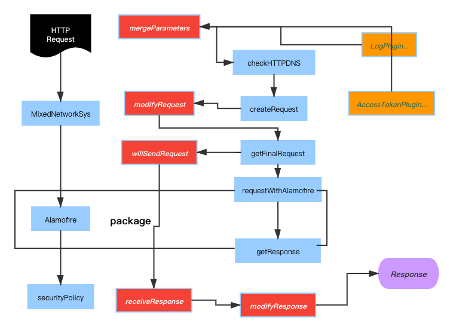

# MixedNetworkSys

## structure chart



## Example

To run the example project, clone the repo, and run `pod install` from the Example directory first.

## Requirements

## Installation

MixedNetworkSys is available through [CocoaPods](https://cocoapods.org). To install
it, simply add the following line to your Podfile:

```ruby
pod 'MixedNetworkSys'
```

## Author

jimmy, zhaofeng7195@yeah.net

## License

MixedNetworkSys is available under the MIT license. See the LICENSE file for more info.
